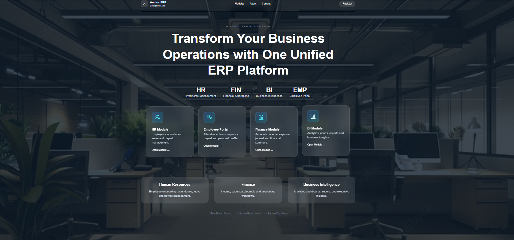
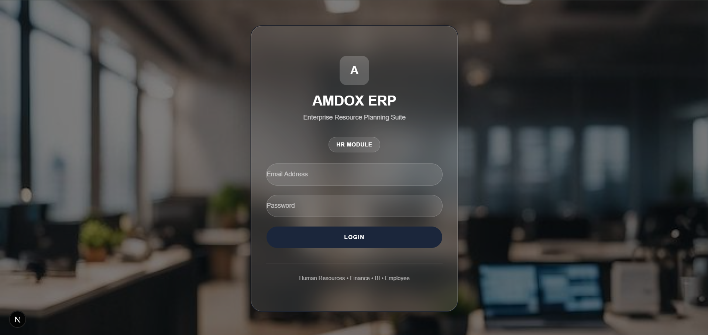
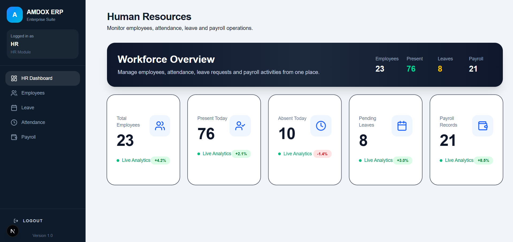
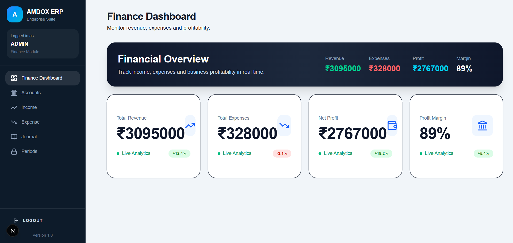
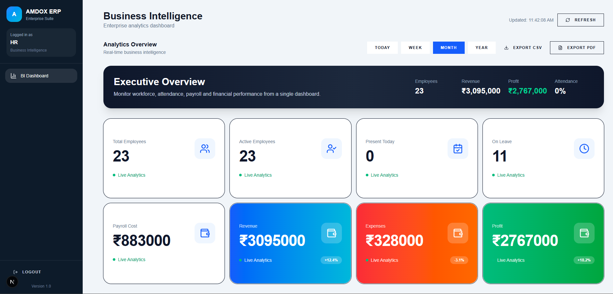

# Amdox ERP System

A modern Enterprise Resource Planning (ERP) system built to manage Human Resources, Finance, Business Intelligence, and Employee Operations through a unified platform.

## Features

### Authentication & Authorization

* JWT Authentication
* Role-Based Access Control
* Admin Registration
* HR Registration
* Employee Login
* Protected Routes

### Human Resources Module

* Employee Management
* Employee Onboarding
* Attendance Tracking
* Leave Management
* Payroll Management
* HR Dashboard

### Employee Portal

* Employee Dashboard
* Check In / Check Out
* Leave Requests
* Payroll Records
* Personal Attendance History

### Finance Module

* Income Management
* Expense Management
* Chart of Accounts
* Journal Entries
* Financial Period Management
* Financial Dashboard

### Business Intelligence Module

* KPI Dashboard
* Revenue Analytics
* Employee Analytics
* Attendance Analytics
* Leave Analytics
* Financial Insights
* Data Visualization & Reports

## Tech Stack

### Frontend

* Next.js
* TypeScript
* Tailwind CSS
* Shadcn UI
* React Query
* Zustand

### Backend

* NestJS
* Prisma ORM
* JWT Authentication

### Database

* PostgreSQL

## Project Structure

```bash
Frontend
├── Landing Page
├── Authentication
├── HR Module
├── Finance Module
├── BI Module
└── Employee Portal

Backend
├── Authentication APIs
├── HR APIs
├── Finance APIs
├── BI APIs
└── Database Management
```

## Screenshots

### Landing Page



### Login Page



### HR Dashboard



### Finance Dashboard



### BI Dashboard




## Installation

### Frontend

```bash
npm install
npm run dev
```

### Backend

```bash
npm install
npm run start:dev
```

### Database

```bash
npx prisma migrate dev
npx prisma generate
```

### Environment Variables

Backend:-
    *DATABASE_URL=
    *JWT_SECRET=
    *PORT=

Frontend:-
    NEXT_PUBLIC_API_URL=


## Future Improvements

* Email Notifications
* Advanced Reporting
* Audit Logs
* Multi-Company Support
* Cloud Deployment

## Author

Pritam

BCA Graduate | Full Stack Developer

Built as an Internship ERP Project using Next.js, NestJS, Prisma, and postgreSQL.
